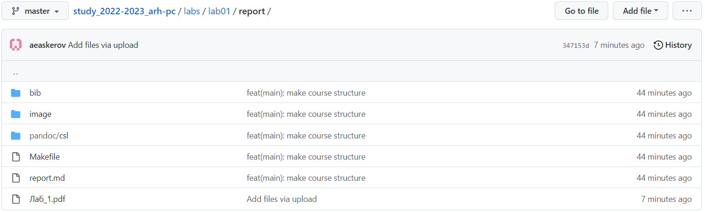

---
## Front matter
title: "Отчёт по лабораторной работе №3"
subtitle: "Система контроля версий Git"
author: "Аскеров Александр Эдуардович"

## Generic otions
lang: ru-RU
toc-title: "Содержание"

## Bibliography
bibliography: bib/cite.bib
csl: pandoc/csl/gost-r-7-0-5-2008-numeric.csl

## Pdf output format
toc: true # Table of contents
toc-depth: 2
lof: true # List of figures
lot: false # List of tables
fontsize: 12pt
linestretch: 1.5
papersize: a4
documentclass: scrreprt
## I18n polyglossia
polyglossia-lang:
  name: russian
  options:
	- spelling=modern
	- babelshorthands=true
polyglossia-otherlangs:
  name: english
## I18n babel
babel-lang: russian
babel-otherlangs: english
## Fonts
mainfont: PT Serif
romanfont: PT Serif
sansfont: PT Sans
monofont: PT Mono
mainfontoptions: Ligatures=TeX
romanfontoptions: Ligatures=TeX
sansfontoptions: Ligatures=TeX,Scale=MatchLowercase
monofontoptions: Scale=MatchLowercase,Scale=0.9
## Biblatex
biblatex: true
biblio-style: "gost-numeric"
biblatexoptions:
  - parentracker=true
  - backend=biber
  - hyperref=auto
  - language=auto
  - autolang=other*
  - citestyle=gost-numeric
## Pandoc-crossref LaTeX customization
figureTitle: "Рис."
tableTitle: "Таблица"
listingTitle: "Листинг"
lofTitle: "Список иллюстраций"
lotTitle: "Список таблиц"
lolTitle: "Листинги"
## Misc options
indent: true
header-includes:
  - \usepackage{indentfirst}
  - \usepackage{float} # keep figures where there are in the text
  - \floatplacement{figure}{H} # keep figures where there are in the text
---

# Цель работы

Целью работы является изучить идеологию и применение средств контроля версий. Приобрести практические навыки по работе с системой git.

# Выполнение лабораторной работы

## Базовая настройка git

Сначала сделаем предварительную конфигурацию git. Откроем терминал и введём следующие команды, указав имя и email владельца репозитория.

{ #fig:1 }

Настроим utf-8 в выводе сообщений git.

{ #fig:2 }

Зададим имя начальной ветки (будем называть её master).

{ #fig:3 }

Параметр autocrlf.

{ #fig:4 }

Параметр safecrlf.

{ #fig:5 }

## Создание SSH-ключа

Для последующей идентификации пользователя на сервере репозиториев необходимо сгенерировать пару ключей (приватный и открытый).

{ #fig:6 }

Ключи должны сохраниться в каталоге ~/.ssh/.

Далее необходимо загрузить сгенерированный открытый ключ. Для этого зайдём на сайт http://github.org/ под своей учётной записью и перейдём в меню Setting. После этого выберем в боковом меню SSH and GPG keys и нажмём кнопку New SSH key. Скопировав из локальной консоли ключ в буфер обмена cat ~/.ssh/id_rsa.pub | xclip -sel clip.

{ #fig:7 }

## Создание рабочего пространства и репозитория курса на основе шаблона

Откроем терминал и создадим каталог для предмета «Архитектура компьютера».

{ #fig:8 }

## Создание репозитория курса на основе шаблона

Репозиторий на основе шаблона можно создать через web-интерфейс github. Перейдём на станицу репозитория с шаблоном курса https://github.com/yamadharma/course-directory-student-template.

Далее выберем Use this template.

{ #fig:9 }

В открывшемся окне зададим имя репозитория (Repository name) study_2022–2023_arh-pc и создадим репозиторий (кнопка Create repository from template).

{ #fig:10 }

Откроем терминал и перейдём в каталог курса.

{ #fig:11 }

Клонируем созданный репозиторий.

{ #fig:12 }

## Настройка каталога курса

Перейдём в каталог курса.

{ #fig:13 }

Удалим лишние файлы.

{ #fig:14 }

Создадим необходимые каталоги.

{ #fig:15 }

Отправим файлы на сервер.

{ #fig:16 }

{ #fig:17 }

Проверка правильности создания иерархии рабочего пространства.

{ #fig:18 }

{ #fig:19 }

## Выполнение заданий для самостоятельной работы.

1. Создаём отчёт в соответствующем каталоге рабочего пространства.

{ #fig:20 }

2. Скопируем отчёты по выполнению предыдущих лабораторных работ в соответствующие каталоги созданного рабочего пространства.

{ #fig:21 }

3. Загрузим файлы на github.

{ #fig:22 }

# Выводы

В процессе успешного выполнения лабораторной работы мной изучена идеология и применение средств контроля версий. Приобретены практические навыки по работе с системой git.
