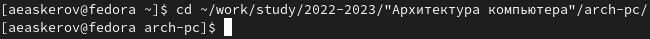
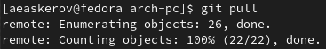
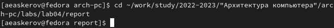
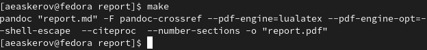
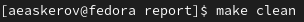
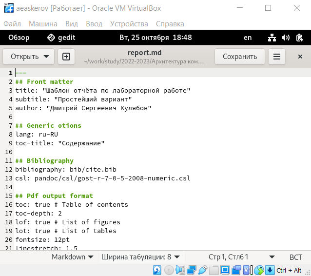

---
## Front matter
title: "Отчёт по лабораторной работе №4"
subtitle: "Язык разметки Markdown"
author: "Аскеров Александр Эдуардович"

## Generic otions
lang: ru-RU
toc-title: "Содержание"

## Bibliography
bibliography: bib/cite.bib
csl: pandoc/csl/gost-r-7-0-5-2008-numeric.csl

## Pdf output format
toc: true # Table of contents
toc-depth: 2
lof: true # List of figures
lot: false # List of tables
fontsize: 12pt
linestretch: 1.5
papersize: a4
documentclass: scrreprt
## I18n polyglossia
polyglossia-lang:
  name: russian
  options:
	- spelling=modern
	- babelshorthands=true
polyglossia-otherlangs:
  name: english
## I18n babel
babel-lang: russian
babel-otherlangs: english
## Fonts
mainfont: PT Serif
romanfont: PT Serif
sansfont: PT Sans
monofont: PT Mono
mainfontoptions: Ligatures=TeX
romanfontoptions: Ligatures=TeX
sansfontoptions: Ligatures=TeX,Scale=MatchLowercase
monofontoptions: Scale=MatchLowercase,Scale=0.9
## Biblatex
biblatex: true
biblio-style: "gost-numeric"
biblatexoptions:
  - parentracker=true
  - backend=biber
  - hyperref=auto
  - language=auto
  - autolang=other*
  - citestyle=gost-numeric
## Pandoc-crossref LaTeX customization
figureTitle: "Рис."
tableTitle: "Таблица"
listingTitle: "Листинг"
lofTitle: "Список иллюстраций"
lotTitle: "Список таблиц"
lolTitle: "Листинги"
## Misc options
indent: true
header-includes:
  - \usepackage{indentfirst}
  - \usepackage{float} # keep figures where there are in the text
  - \floatplacement{figure}{H} # keep figures where there are in the text
---

# Цель работы

Освоить процедуры оформления отчётов с помощью легковесного языка разметки Markdown.

# Выполнение лабораторной работы

Откроем терминал и перейдём в каталог курса сформированный при выполнении лабораторной работы №3.

{ #fig:1 }

Обновим локальный репозиторий, скачав изменения из удалённого репозитория с помощью команды git pull.

{ #fig:2 }

Перейдём в каталог с шаблоном отчёта по лабораторной работе № 4.

{ #fig:3 }

Проведём компиляцию шаблона с использованием Makefile. Для этого введём команду make. При успешной компиляции должны сгенерироваться файлы report.pdf и report.docx.

{ #fig:4 }

Удалим полученные файлы с использованием Makefile. Для этого введём команду make clean.

{ #fig:5 }

Откроем файл report.md c помощью текстового редактора gedit и изучим его.

{ #fig:6 }

# Выводы

Освоены процедуры оформления отчётов с помощью легковесного языка разметки Markdown.
