---
## Front matter
title: "Отчёт по лабораторной работе №5"
subtitle: "Создание и процесс обработки программ на языке ассемблера NASM"
author: "Аскеров Алекcандр Эдуардович"

## Generic otions
lang: ru-RU
toc-title: "Содержание"

## Bibliography
bibliography: bib/cite.bib
csl: pandoc/csl/gost-r-7-0-5-2008-numeric.csl

## Pdf output format
toc: true # Table of contents
toc-depth: 2
lof: true # List of figures
lot: false # List of tables
fontsize: 12pt
linestretch: 1.5
papersize: a4
documentclass: scrreprt
## I18n polyglossia
polyglossia-lang:
  name: russian
  options:
	- spelling=modern
	- babelshorthands=true
polyglossia-otherlangs:
  name: english
## I18n babel
babel-lang: russian
babel-otherlangs: english
## Fonts
mainfont: PT Serif
romanfont: PT Serif
sansfont: PT Sans
monofont: PT Mono
mainfontoptions: Ligatures=TeX
romanfontoptions: Ligatures=TeX
sansfontoptions: Ligatures=TeX,Scale=MatchLowercase
monofontoptions: Scale=MatchLowercase,Scale=0.9
## Biblatex
biblatex: true
biblio-style: "gost-numeric"
biblatexoptions:
  - parentracker=true
  - backend=biber
  - hyperref=auto
  - language=auto
  - autolang=other*
  - citestyle=gost-numeric
## Pandoc-crossref LaTeX customization
figureTitle: "Рис."
tableTitle: "Таблица"
listingTitle: "Листинг"
lofTitle: "Список иллюстраций"
lotTitle: "Список таблиц"
lolTitle: "Листинги"
## Misc options
indent: true
header-includes:
  - \usepackage{indentfirst}
  - \usepackage{float} # keep figures where there are in the text
  - \floatplacement{figure}{H} # keep figures where there are in the text
---

# Цель работы

Освоить процедуры компиляции и сборки программ, написанных на ассемблере NASM.

# Выполнение лабораторной работы

## Программа Hello world!

Рассмотрим пример простой программы на языке ассемблера NASM. Традиционно первая программа выводит приветственное сообщение Hello world! на экран.

Создадим каталог для работы с программами на языке ассемблера NASM.

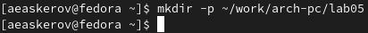{ #fig:1 }

Перейдём в созданный каталог.

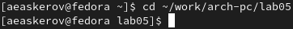{ #fig:2 }

Создадим текстовый файл с именем hello.asm.

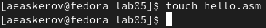{ #fig:3 }

Откроем этот файл с помощью текстового редактора gedit и введём в него следующий текст.

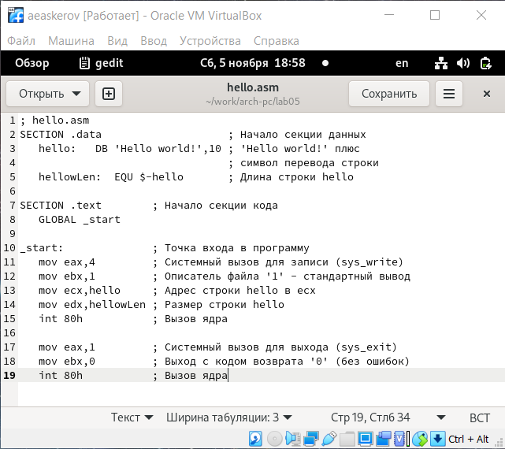{ #fig:4 }

## Транслятор NASM

NASM превращает текст программы в объектный код. Например, для компиляции приведённого выше текста программы «Hello World» необходимо написать: nasm -f elf hello.asm.

Если текст программы набран без ошибок, то транслятор преобразует текст программы из файла hello.asm в объектный код, который запишется в файл hello.o. Таким образом, имена всех файлов получаются из имени входного файла и расширения по умолчанию. При наличии ошибок объектный файл не создаётся, а после запуска транслятора появятся сообщения об ошибках или предупреждения.

С помощью команды ls проверим, что объектный файл был создан. Получившийся объектный файл имеет имя hello.

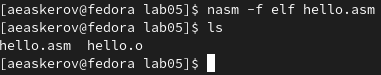{ #fig:5 }

NASM не запускают без параметров. Ключ -f указывает транслятору, что требуется создать бинарные файлы в формате ELF. Следует отметить, что формат elf64 позволяет создавать исполняемый код, работающий под 64-битными версиями Linux. Для 32-битных версий ОС указываем в качестве формата просто elf.

NASM всегда создаёт выходные файлы в текущем каталоге.

## Расширенный синтаксис командной строки NASM

Скомпилируем исходный файл hello.asm в obj.o (опция - o позволяет задать имя объектного файла, в данном случае obj.o), при этом формат выходного файла будет elf, и в него будут включены символы для отладки (опция -g), кроме того, будет создан файл листинга list.lst (опция -l). Для этого выполним следующую команду.

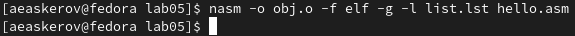{ #fig:6 }

С помощью команды ls проверим, что файлы были созданы.

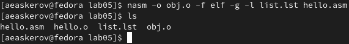{ #fig:7 }

## Компоновщик LD

Чтобы получить исполняемую программу, объектный файл необходимо передать на обработку компоновщику. С помощью команды ls проверим, что исполняемый файл hello был создан.

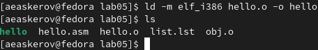{ #fig:8 }

Выполним следующую команду: ld -m elf_i386 obj.o -o main.

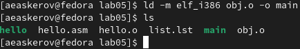{ #fig:9 }

Исполняемый файл будет иметь имя main, а объектный файл, из которого собран этот исполняемый файл, будет иметь имя obj.o.

## Запуск исполняемого файла

Запустить на выполнение созданный исполняемый файл, находящийся в текущем каталоге, можно, набрав в командной строке: ./hello.

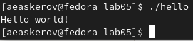{ #fig:10 }

## Задание для самостоятельной работы

1. В каталоге ~/work/arch-pc/lab05 с помощью команды cp создадим копию файла hello.asm с именем lab5.asm.

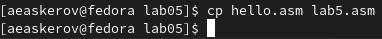{ #fig:11 }

2. С помощью любого текстового редактора внесём изменения в текст программы в файле lab5.asm так, чтобы вместо Hello world! на экран выводилась строка с фамилией и именем.

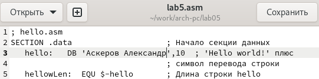{ #fig:12 }

3. Оттранслируем полученный текст программы lab5.asm в объектный файл. Выполним компоновку объектного файла и запустим получившийся исполняемый файл.

{ #fig:13 }

4. Скопируем файлы hello.asm и lab5.asm в локальный репозиторий в каталог ~/work/study/2022-2023/"Архитектура компьютера"/archpc/labs/lab05/. Загрузим файлы на Github.

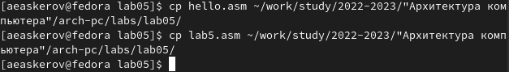{ #fig:14 }

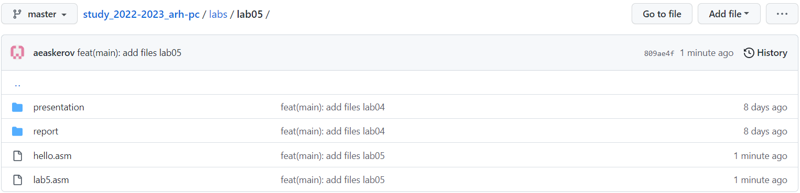{ #fig:15 }

# Выводы

Освоены процедуры компиляции и сборки программ, написанных на ассемблере NASM.
