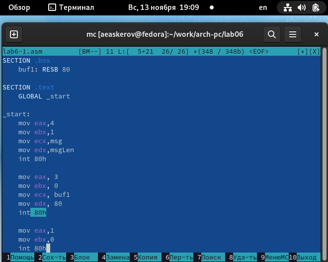
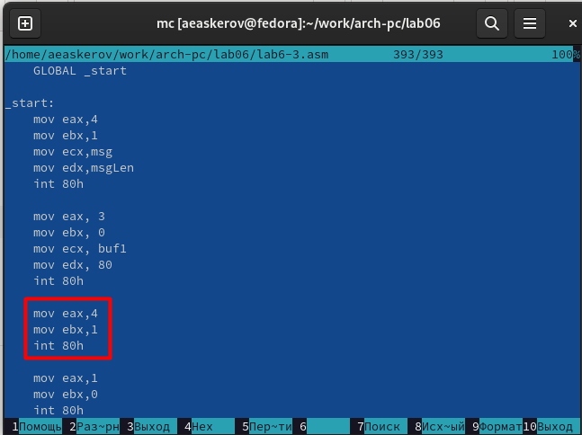

---
## Front matter
title: "Отчёт по лабораторной работе №6"
subtitle: "Основы работы с Midnight Commander (mc). Структура программы на языке ассемблера NASM. Системные вызовы в ОС GNU Linux."
author: "Аскеров Александр Эдуардович"

## Generic otions
lang: ru-RU
toc-title: "Содержание"

## Bibliography
bibliography: bib/cite.bib
csl: pandoc/csl/gost-r-7-0-5-2008-numeric.csl

## Pdf output format
toc: true # Table of contents
toc-depth: 2
lof: true # List of figures
lot: false # List of tables
fontsize: 12pt
linestretch: 1.5
papersize: a4
documentclass: scrreprt
## I18n polyglossia
polyglossia-lang:
  name: russian
  options:
	- spelling=modern
	- babelshorthands=true
polyglossia-otherlangs:
  name: english
## I18n babel
babel-lang: russian
babel-otherlangs: english
## Fonts
mainfont: PT Serif
romanfont: PT Serif
sansfont: PT Sans
monofont: PT Mono
mainfontoptions: Ligatures=TeX
romanfontoptions: Ligatures=TeX
sansfontoptions: Ligatures=TeX,Scale=MatchLowercase
monofontoptions: Scale=MatchLowercase,Scale=0.9
## Biblatex
biblatex: true
biblio-style: "gost-numeric"
biblatexoptions:
  - parentracker=true
  - backend=biber
  - hyperref=auto
  - language=auto
  - autolang=other*
  - citestyle=gost-numeric
## Pandoc-crossref LaTeX customization
figureTitle: "Рис."
tableTitle: "Таблица"
listingTitle: "Листинг"
lofTitle: "Список иллюстраций"
lotTitle: "Список таблиц"
lolTitle: "Листинги"
## Misc options
indent: true
header-includes:
  - \usepackage{indentfirst}
  - \usepackage{float} # keep figures where there are in the text
  - \floatplacement{figure}{H} # keep figures where there are in the text
---

# Цель работы

Приобрести практические навыки работы в Midnight Commander. Освоить инструкции языка ассемблера mov и int.

# Выполнение лабораторной работы

1. Откроем Midnight Commander.

{ #fig:1 }

2. Пользуясь клавишами Up, Down и Enter перейдём в каталог ~/work/archpc, созданный при выполнении лабораторной работы №5.

{ #fig:2 }

3. С помощью функциональной клавиши F7 создадим папку lab06 и перейдём в созданный каталог.

{ #fig:3 }

4. Пользуясь строкой ввода и командой touch создадим файл lab6-1.asm.

{ #fig:4 }

5. С помощью функциональной клавиши F4 откроем файл lab6-1.asm для редактирования во встроенном редакторе.

{ #fig:5 }

6. Введём текст программы из листинга 6.1, сохраним изменения и закроем файл.

{ #fig:6 }

7. С помощью функциональной клавиши F3 откроем файл lab6-1.asm для просмотра. Убедимся, что файл содержит текст программы.

{ #fig:7 }

8. Оттранслируем текст программы lab6-1.asm в объектный файл. Выполним компоновку объектного файла и запустим получившийся исполняемый файл. Программа выводит строку 'Введите строку:' и ожидает ввода с клавиатуры. На запрос введём ФИО.

{ #fig:8 }

## Подключение внешнего файла in_out.asm

9. Скачаем файл in_out.asm со страницы курса в ТУИС.

10. Скопируем файл in_out.asm в каталог с файлом lab6-1.asm с помощью функциональной клавиши F5.

{ #fig:9 }

11. С помощью функциональной клавиши F6 создадим копию файла lab6-1.asm с именем lab6-2.asm. Выделим файл lab6-1.asm, нажмём клавишу F6, введём имя файла lab6-2.asm и нажмём клавишу Enter.

{ #fig:10 }

12. Исправим текст программы в файле lab6-2.asm с использованием подпрограмм из внешнего файла in_out.asm (используем подпрограммы sprintLF, sread и quit). Создадим исполняемый файл и проверим его работу.

{ #fig:11 }

{ #fig:12 }

13. В файле lab6-2.asm заменим подпрограмму sprintLF на sprint. Создадим исполняемый файл и проверим его работу. Разница в отсутствии переноса строки.

{ #fig:13 }

## Задания для самостоятельной работы

1. Создадим копию файла lab6-1.asm. Внесём изменения в программу (без использования внешнего файла in_out.asm), так чтобы она работала по следующему алгоритму:
* вывести приглашение типа “Введите строку:”;
* ввести строку с клавиатуры;
* вывести введённую строку на экран.

Регистры ecx и edx остались без изменений по той причине, что мы записали в них необходимые значения (текстовую строку и ограничение по длине, соответственно) в предыдущем блоке программы. После выполнения этого блока значения этих регистров не менялись.

{ #fig:14 }

2. Получим исполняемый файл lab6-3 и проверим его работу. На приглашение введём свои имя и фамилию.

{ #fig:15 }

3. Создадим копию файла lab6-2.asm. Исправим текст программы с использованием подпрограмм из внешнего файла in_out.asm, так чтобы она работала по следующему алгоритму:
* вывести приглашение типа “Введите строку:”;
* ввести строку с клавиатуры;
* вывести введённую строку на экран.

{ #fig:16 }

4. Создадим исполняемый файл lab6-4 и проверим его работу.

{ #fig:17 }

# Выводы

Приобретены практические навыки работы в Midnight Commander. Освоены инструкции языка ассемблера mov и int.
