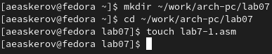
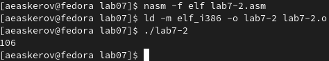

---
## Front matter
title: "Отчёт по лабораторной работе №7"
subtitle: "Арифметические операции в NASM"
author: "Аскеров Александр Эдуардович"

## Generic otions
lang: ru-RU
toc-title: "Содержание"

## Bibliography
bibliography: bib/cite.bib
csl: pandoc/csl/gost-r-7-0-5-2008-numeric.csl

## Pdf output format
toc: true # Table of contents
toc-depth: 2
lof: true # List of figures
lot: false # List of tables
fontsize: 12pt
linestretch: 1.5
papersize: a4
documentclass: scrreprt
## I18n polyglossia
polyglossia-lang:
  name: russian
  options:
	- spelling=modern
	- babelshorthands=true
polyglossia-otherlangs:
  name: english
## I18n babel
babel-lang: russian
babel-otherlangs: english
## Fonts
mainfont: PT Serif
romanfont: PT Serif
sansfont: PT Sans
monofont: PT Mono
mainfontoptions: Ligatures=TeX
romanfontoptions: Ligatures=TeX
sansfontoptions: Ligatures=TeX,Scale=MatchLowercase
monofontoptions: Scale=MatchLowercase,Scale=0.9
## Biblatex
biblatex: true
biblio-style: "gost-numeric"
biblatexoptions:
  - parentracker=true
  - backend=biber
  - hyperref=auto
  - language=auto
  - autolang=other*
  - citestyle=gost-numeric
## Pandoc-crossref LaTeX customization
figureTitle: "Рис."
tableTitle: "Таблица"
listingTitle: "Листинг"
lofTitle: "Список иллюстраций"
lotTitle: "Список таблиц"
lolTitle: "Листинги"
## Misc options
indent: true
header-includes:
  - \usepackage{indentfirst}
  - \usepackage{float} # keep figures where there are in the text
  - \floatplacement{figure}{H} # keep figures where there are in the text
---

# Цель работы

Освоить арифметические инструкции языка ассемблера NASM.

# Выполнение лабораторной работы

## Символьные и численные данные в NASM

1. Создадим каталог для программ лабораторной работы № 7, перейдём в него и создадим файл lab7-1.asm.

{ #fig:1 }

2. Рассмотрим примеры программ вывода символьных и численных значений. Программы будут выводить значения, записанные в регистр eax.

Введём в файл lab7-1.asm текст программы из листинга 7.1. В данной программе в регистр eax записывается символ 6 (mov eax,'6'), в регистр ebx символ 4 (mov ebx,'4'). Далее к значению в регистре eax прибавляем значение регистра ebx (add eax,ebx, результат сложения запишется в регистр eax). Далее выводим результат. Так как для работы функции sprintLF в регистр eax должен быть записан адрес, необходимо использовать дополнительную переменную. Для этого запишем значение регистра eax в переменную buf1 (mov [buf1],eax), а затем запишем адрес переменной buf1 в регистр eax (mov eax,buf1) и вызовем функцию sprintLF.

{ #fig:2 }

Создадим исполняемый файл и запустим его.

{ #fig:3 }

В данном случае при выводе значения регистра eax мы ожидаем увидеть число 10. Однако результатом будет символ j. Это происходит потому, что код символа 6 равен 00110110 в двоичном представлении (или 54 в десятичном представлении), а код символа 4 – 00110100 (52). Команда add eax,ebx запишет в регистр eax сумму кодов – 01101010 (106), что в свою очередь является кодом символа j (см. таблицу ASCII в приложении).

3. Далее изменим текст программы и вместо символов, запишем в регистры числа. Исправим текст программы (Листинг 1) следующим образом: заменим строки mov eax,'6' mov ebx,'4' на строки mov eax,6 mov ebx,4.

{ #fig:4 }

Создадим исполняемый файл и запустим его.

{ #fig:5 }

Как и в предыдущем случае при исполнении программы мы не получим число 10. В данном случае выводится символ с кодом 10. Из таблицы ASCII видно, что это символ переноса строки. При выводе на экран он не отображается.

4. Как отмечалось выше, для работы с числами в файле in_out.asm реализованы подпрограммы для преобразования ASCII символов в числа и обратно. Преобразуем текст программы из Листинга 7.1 с использованием этих функций.

Создадим файл lab7-2.asm в каталоге ~/work/arch-pc/lab07 и введём в него текст программы из листинга 7.2.

{ #fig:6 }

{ #fig:7 }

Создадим исполняемый файл и запустим его.

{ #fig:8 }

В результате работы программы мы получаем число 106. В данном случае, как и в первом, команда add складывает коды символов ‘6’ и ‘4’ (54+52=106). Однако, в отличии от программы из листинга 7.1, функция iprintLF позволяет вывести число, а не символ, кодом которого является это число.

5. Аналогично предыдущему примеру изменим символы на числа. Заменим строки mov eax,'6' mov ebx,'4' на строки mov eax,6 mov ebx,4.

{ #fig:9 }

Создадим исполняемый файл и запустим его. В результате мы получили 10.

{ #fig:10 }

Заменим функцию iprintLF на iprint. Создадим исполняемый файл и запустим его. Отличие вывода функции iprintLF от iprint заключается в том, что исчезает перенос строки после вывода информации на экран.

## Выполнение арифметических операций в NASM

В качестве примера выполнения арифметических операций в NASM приведем программу вычисления арифметического выражения f(x) = (5 * 2 + 3)/3. 

Создадим файл lab7-3.asm в каталоге ~/work/arch-pc/lab07.

{ #fig:11 }

Внимательно изучим текст программы из листинга 7.3 и введём в lab7- 3.asm.

{ #fig:12 }

Создадим исполняемый файл и запустим его.

{ #fig:13 }

Изменим текст программы для вычисления выражения f(x) = (4 * 6 + 2)/5.

{ #fig:14 }

Создадим исполняемый файл и проверим его работу.

{ #fig:15 }

7. В качестве другого примера рассмотрим программу вычисления варианта задания по номеру студенческого билета, работающую по следующему алгоритму: 
* вывести запрос на введение № студенческого билета
* вычислить номер варианта по формуле: (Sn mod 20) + 1, где Sn – номер студенческого билета (в данном случае a mod b – это остаток от деления a на b)
* вывести на экран номер варианта

В данном случае число, над которым необходимо проводить арифметические операции, вводится с клавиатуры. Как отмечалось выше ввод с клавиатуры осуществляется в символьном виде, и для корректной работы арифметических операций в NASM символы необходимо преобразовать в числа. Для этого может быть использована функция atoi из файла in_out.asm.

Создадим файл variant.asm в каталоге ~/work/arch-pc/lab07.

{ #fig:16 }

Внимательно изучим текст программы из листинга 7.4 и введём в файл variant.asm.

{ #fig:17 }

Создадим исполняемый файл и запустим его.

{ #fig:18 }

Ответы на вопросы:

1. Какие строки листинга 7.4 отвечают за вывод на экран сообщения ‘Ваш вариант:’?

{ #fig:19 }

2. Для чего используется следующие инструкции? Nasm	 mov ecx, x mov edx, 80 	call sread.

Для того чтобы пользователь ввёл с клавиатуры сообщение размером не больше 80 байт, то есть студенческий номер, в переменную x.

3. Для чего используется инструкция “call atoi”?

Для того чтобы можно было оперировать не с символами из ASCII, стоящими под определёнными номерами, а с числами. “atoi– функция преобразует ascii-код символа в целое число и записывает результат в регистр eax, перед вызовом atoi в регистр eax необходимо записать число (mov eax,<int>)”.

4. Какие строки листинга 7.4 отвечают за вычисление варианта?

{ #fig:20 }

5. В какой регистр записывается остаток от деления при выполнении инструкции “div ebx”?

В регистр edx.

6. Для чего используется инструкция “inc edx”?

Для того чтобы увеличить ответ, то есть остаток от деления номера студенческого билета на двадцать, на единицу в соответствии с условием задания.

7. Какие строки листинга 7.4 отвечают за вывод на экран результата вычислений?

{ #fig:21 }

## Задание для самостоятельной работы

1. Написать программу вычисления выражения y = f(x). Программа должна выводить выражение для вычисления, выводить запрос на ввод значения x, вычислять заданное выражение в зависимости от введенного x, выводить результат вычислений. Вид функции f(x) выбрать из таблицы 7.3 вариантов заданий в соответствии с номером, полученным при выполнении лабораторной работы. Создайте исполняемый файл и проверьте его работу для значений x1 и x2 из 7.3.

Функция 19: f(x)=(x*1/3+5)*7. x1=3;x2=9.

{ #fig:22 }

{ #fig:23 }

# Выводы

Освоены арифметические инструкции языка ассемблера NASM.
