---
## Front matter
title: "Отчёт по лабораторной работе №8"
subtitle: "Команды условного и безусловного переходов в NASM. Программирование ветвлений"
author: "Аскеров Александр Эдуардович"

## Generic otions
lang: ru-RU
toc-title: "Содержание"

## Bibliography
bibliography: bib/cite.bib
csl: pandoc/csl/gost-r-7-0-5-2008-numeric.csl

## Pdf output format
toc: true # Table of contents
toc-depth: 2
lof: true # List of figures
lot: false # List of tables
fontsize: 12pt
linestretch: 1.5
papersize: a4
documentclass: scrreprt
## I18n polyglossia
polyglossia-lang:
  name: russian
  options:
	- spelling=modern
	- babelshorthands=true
polyglossia-otherlangs:
  name: english
## I18n babel
babel-lang: russian
babel-otherlangs: english
## Fonts
mainfont: PT Serif
romanfont: PT Serif
sansfont: PT Sans
monofont: PT Mono
mainfontoptions: Ligatures=TeX
romanfontoptions: Ligatures=TeX
sansfontoptions: Ligatures=TeX,Scale=MatchLowercase
monofontoptions: Scale=MatchLowercase,Scale=0.9
## Biblatex
biblatex: true
biblio-style: "gost-numeric"
biblatexoptions:
  - parentracker=true
  - backend=biber
  - hyperref=auto
  - language=auto
  - autolang=other*
  - citestyle=gost-numeric
## Pandoc-crossref LaTeX customization
figureTitle: "Рис."
tableTitle: "Таблица"
listingTitle: "Листинг"
lofTitle: "Список иллюстраций"
lotTitle: "Список таблиц"
lolTitle: "Листинги"
## Misc options
indent: true
header-includes:
  - \usepackage{indentfirst}
  - \usepackage{float} # keep figures where there are in the text
  - \floatplacement{figure}{H} # keep figures where there are in the text
---

# Цель работы

Изучить команды условного и безусловного переходов. Приобрести навыки написания программ с использованием переходов. Познакомиться с назначением и структурой файла листинга.

# Выполнение лабораторной работы

## Реализация переходов в NASM

1. Создадим каталог для программ лабораторной работы №8, перейдём в него и создадим файл lab8-1.asm.

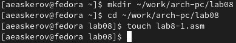{ #fig:1 }

2. Инструкция jmp в NASM используется для реализации безусловных переходов. Рассмотрим пример программы с использованием инструкции jmp. Введём в файл lab8-1.asm текст программы из листинга 8.1.

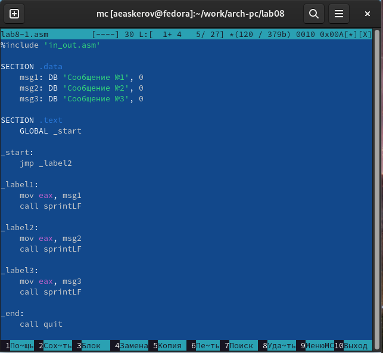{ #fig:2 }

Создадим исполняемый файл и запустим его. Результат работы данной программы будет следующим.

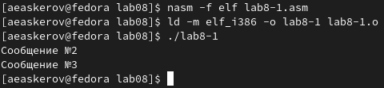{ #fig:3 }

Таким образом, использование инструкции jmp _label2 меняет порядок исполнения инструкций и позволяет выполнить инструкции начиная с метки _label2, пропустив вывод первого сообщения.

Инструкция jmp позволяет осуществлять переходы не только вперёд, но и назад. Изменим программу таким образом, чтобы она выводила сначала ‘Сообщение №2’, потом ‘Сообщение №1’ и завершала работу. Для этого в текст программы после вывода сообщения №2 добавим инструкцию jmp с меткой _label1 (т.е. переход к инструкциям вывода сообщения №1) и после вывода сообщения №1 добавим инструкцию jmp с меткой _end (т.е. переход к инструкции call quit). Изменим текст программы в соответствии с листингом 8.2.

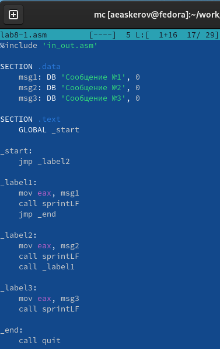{ #fig:4 }

Создадим исполняемый файл и проверим его работу.

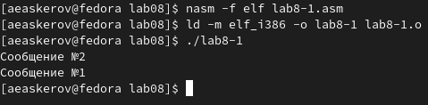{ #fig:5 }

Изменим текст программы, добавив или изменив инструкции jmp так, чтобы вывод программы был следующим: сначала Сообщение №3, потом Сообщение №2 и потом Сообщение №1.

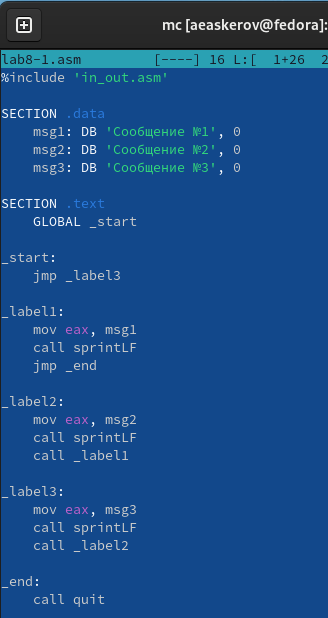{ #fig:6 }

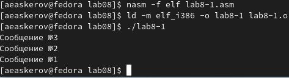{ #fig:7 }

3. Использование инструкции jmp приводит к переходу в любом случае. Однако часто при написании программ необходимо использовать условные переходы, т.е. переход должен происходить, если выполнено какое-либо условие. В качестве примера рассмотрим программу, которая определяет и выводит на экран наибольшую из 3 целочисленных переменных: A, B и C. Значения для A и C задаются в программе, значение B вводится с клавиатуры.

Создадим файл lab8-2.asm в каталоге ~/work/arch-pc/lab08. Внимательно изучим текст программы из листинга 8.3 и введём в lab8-2.asm.

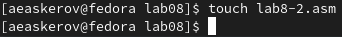{ #fig:8 }

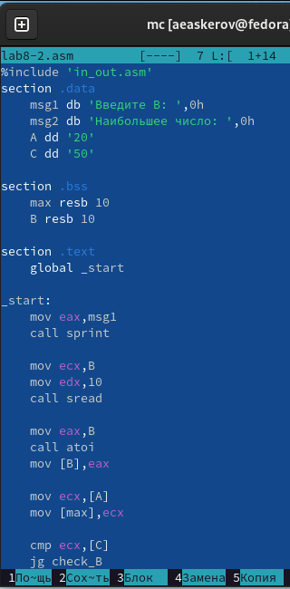{ #fig:9 }

Создадим исполняемый файл и проверим его работу для разных значений B.

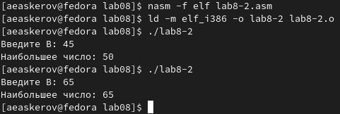{ #fig:10 }

Обратим внимание, в данном примере переменные A и С сравниваются как символы, а переменная B и максимум из A и С как числа (для этого используется функция atoi преобразования символа в число). Это сделано для демонстрации того, как сравниваются данные. Данную программу можно упростить и сравнивать все 3 переменные как символы (т.е. не использовать функцию atoi). Однако если переменные преобразовать из символов в числа, над ними можно корректно проводить арифметические операции.

## Изучение структуры файлов листинга

4. Обычно nasm создаёт в результате ассемблирования только объектный файл. Получить файл листинга можно, указав ключ -l и задав имя файла листинга в командной строке. Создадим файл листинга для программы из файла lab8-2.asm.

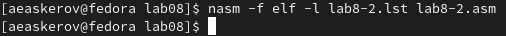{ #fig:11 }

Откроем файл листинга lab8-2.lst с помощью любого текстового редактора, например, mcedit.

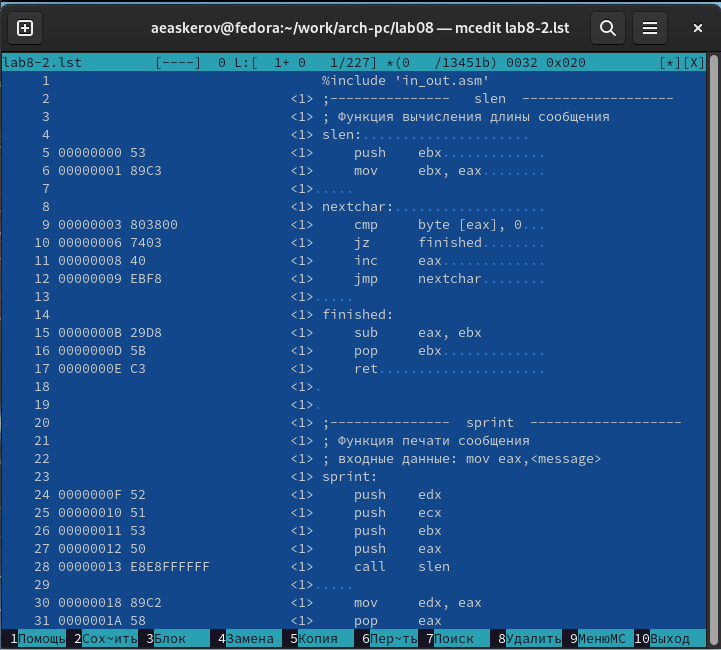{ #fig:12 }

Внимательно ознакомимся с его форматом и содержимым. Подробно объясним содержимое трёх строк файла листинга по выбору.

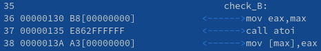{ #fig:13 }

36, 37, 38 – номера строк.

00000130, 00000135, 0000013A – адрес строки.

B8\[00000000\], E862FFFFFF, A3\[00000000\] – машинный код.

“mov eax,max”, “call atoi”, “mov \[max\],eax” – исходный текст программы.

Откроем файл с программой lab8-2.asm и в любой инструкции с двумя операндами удалим один операнд. Выполним трансляцию с получением файла листинга.

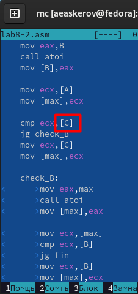{ #fig:14 }

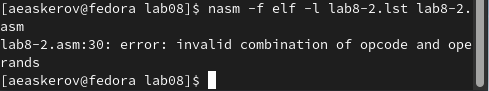{ #fig:15 }

Мы видим, что в результате удаления операнда вышла ошибка и никакие файлы не сформировались, а в листинге появилось сообщение об ошибке.

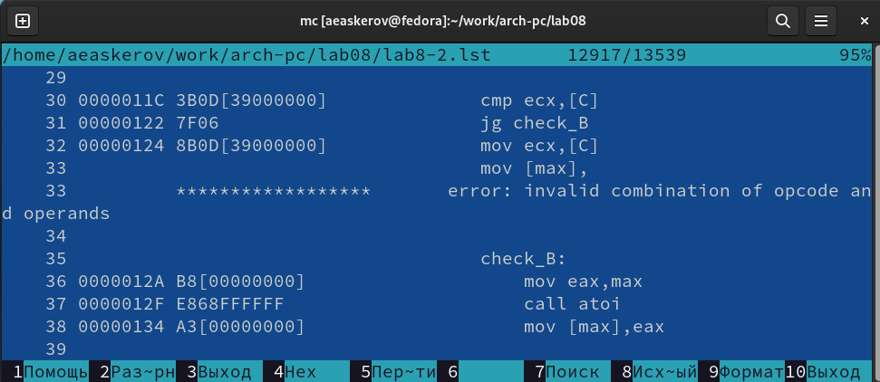{ #fig:16 }

## Задание для самостоятельной работы

1. Напишем программу нахождения наименьшей из 3 целочисленных переменных a, b и c. Значения переменных выберем из табл. 8.5 в соответствии с вариантом, полученным при выполнении лабораторной работы № 7. Создадим исполняемый файл и проверим его работу.

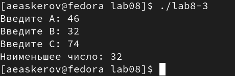{ #fig:17 }

2. Напишем программу, которая для введённых с клавиатуры значений x и a вычисляет значение заданной функции f(x) и выводит результат вычислений. Вид функции f(x) выберем из таблицы 8.6 вариантов заданий в соответствии с вариантом, полученным при выполнении лабораторной работы № 7. Создадим исполняемый файл и проверим его работу для значений x и a из 8.6.

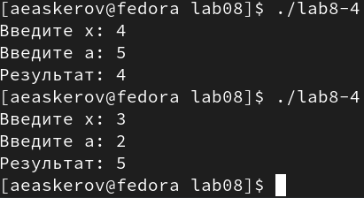{ #fig:18 }

# Выводы

Изучены команды условного и безусловного переходов. Приобретены навыки написания программ с использованием переходов. Ознакомлен с назначением и структурой файла листинга.
