---
## Front matter
title: "Отчёт по лабораторной работе №9"
subtitle: "Программирование цикла. Обработка аргументов командной строки"
author: "Аскеров Александр Эдуардович"

## Generic otions
lang: ru-RU
toc-title: "Содержание"

## Bibliography
bibliography: bib/cite.bib
csl: pandoc/csl/gost-r-7-0-5-2008-numeric.csl

## Pdf output format
toc: true # Table of contents
toc-depth: 2
lof: true # List of figures
lot: false # List of tables
fontsize: 12pt
linestretch: 1.5
papersize: a4
documentclass: scrreprt
## I18n polyglossia
polyglossia-lang:
  name: russian
  options:
	- spelling=modern
	- babelshorthands=true
polyglossia-otherlangs:
  name: english
## I18n babel
babel-lang: russian
babel-otherlangs: english
## Fonts
mainfont: PT Serif
romanfont: PT Serif
sansfont: PT Sans
monofont: PT Mono
mainfontoptions: Ligatures=TeX
romanfontoptions: Ligatures=TeX
sansfontoptions: Ligatures=TeX,Scale=MatchLowercase
monofontoptions: Scale=MatchLowercase,Scale=0.9
## Biblatex
biblatex: true
biblio-style: "gost-numeric"
biblatexoptions:
  - parentracker=true
  - backend=biber
  - hyperref=auto
  - language=auto
  - autolang=other*
  - citestyle=gost-numeric
## Pandoc-crossref LaTeX customization
figureTitle: "Рис."
tableTitle: "Таблица"
listingTitle: "Листинг"
lofTitle: "Список иллюстраций"
lotTitle: "Список таблиц"
lolTitle: "Листинги"
## Misc options
indent: true
header-includes:
  - \usepackage{indentfirst}
  - \usepackage{float} # keep figures where there are in the text
  - \floatplacement{figure}{H} # keep figures where there are in the text
---

# Цель работы

Приобрести навыки написания программ с использованием циклов и обработкой аргументов командной строки.

# Выполнение лабораторной работы

## Реализация циклов в NASM

Создадим каталог для программ лабораторной работы №9, перейдём в него и создадим файл lab9-1.asm.

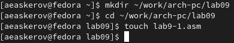{ #fig:1 }

При реализации циклов в NASM с использованием инструкции loop необходимо помнить о том, что эта инструкция использует регистр ecx в качестве счётчика и на каждом шаге уменьшает его значение на единицу. В качестве примера рассмотрим программу, которая выводит значение регистра ecx. Внимательно изучим текст программы (листинг 9.1).

Введём в файл lab9-1.asm текст программы из листинга 9.1. Создадим исполняемый файл и проверим его работу.

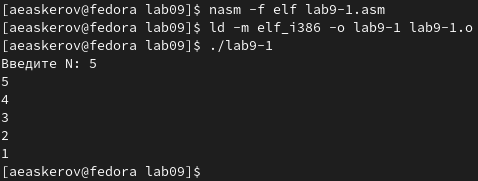{ #fig:2 }

Данный пример показывает, что использование регистра ecx в теле цикла loop может привести к некорректной работе программы. Изменим текст программы, добавив изменение значения регистра ecx в цикле.

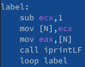{ #fig:3 }

Создадим исполняемый файл и проверим его работу.

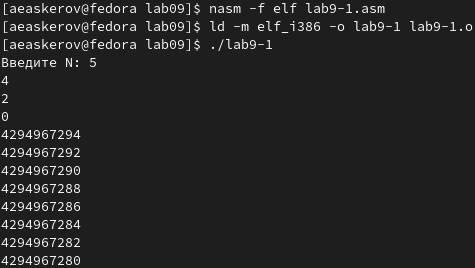{ #fig:4 }

Значения ecx: 4, 2, 0, 4294967294, … Значения уменьшаются на два. Число проходов цикла не соответствует значению N введённому с клавиатуры.

Для использования регистра ecx в цикле и сохранения корректности работы программы можно использовать стек. Внесём изменения в текст программы, добавив команды push и pop (добавление в стек и извлечение из стека) для сохранения значения счётчика цикла loop.

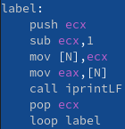{ #fig:5 }

Создадим исполняемый файл и проверим его работу.

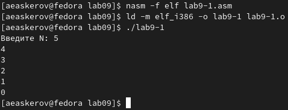{ #fig:6 }

В данном случае число проходов цикла соответствует значению N введённому с клавиатуры.

## Обработка аргументов командной строки

При разработке программ иногда встаёт необходимость указывать аргументы, которые будут использоваться в программе, непосредственно из командной строки при запуске программы.

При запуске программы в NASM аргументы командной строки загружаются в стек в обратном порядке, кроме того в стек записывается имя программы и общее количество аргументов. Последние два элемента стека для программы, скомпилированной NASM, – это всегда имя программы и количество переданных аргументов.

Таким образом, для того чтобы использовать аргументы в программе, их просто нужно извлечь из стека. Обработку аргументов нужно проводить в цикле. Т.е. сначала нужно извлечь из стека количество аргументов, а затем циклично для каждого аргумента выполнить логику программы. В качестве примера рассмотрим программу, которая выводит на экран аргументы командной строки. Внимательно изучим текст программы (листинг 9.2).

Создадим файл lab9-2.asm в каталоге ~/work/arch-pc/lab09 и введём в него текст программы из листинга 9.2.

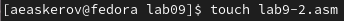{ #fig:7 }

Создадим исполняемый файл и запустим его, указав аргументы 1, 2, 3.

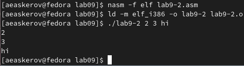{ #fig:8 }

Программой были обработаны 3 аргумента.

Рассмотрим ещё один пример программы, которая выводит сумму чисел, которые передаются в программу как аргументы. Создадим файл lab9-3.asm в каталоге ~/work/arch-pc/lab09 и введём в него текст программы из листинга 9.3.

Создадим исполняемый файл и запустим его, указав аргументы.

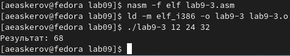{ #fig:9 }

Изменим текст программы из листинга 9.3 для вычисления произведения аргументов командной строки.

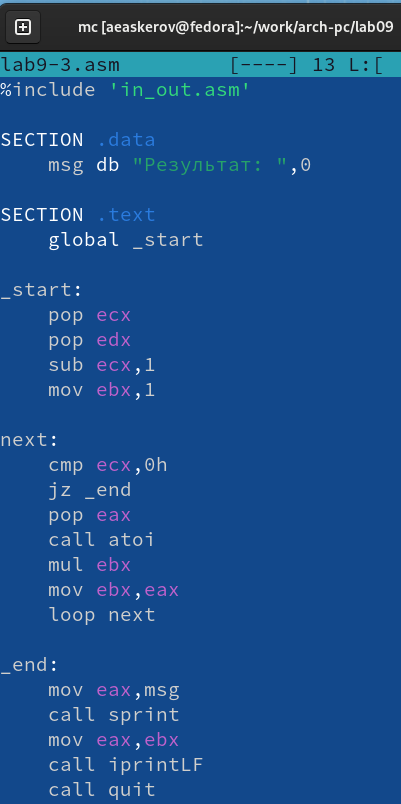{ #fig:10 }

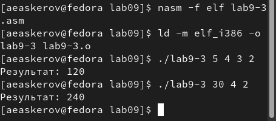{ #fig:11 }

## Задание для самостоятельной работы

Напишем программу, которая находит сумму значений функции f(x) для x = x1, x2, ..., xn, т.е. программа должна выводить значение f(x1) + f(x2)+...+f(xn). Значения xi передаются как аргументы. Вид функции f(x) выберем из таблицы 9.1 вариантов заданий в соответствии с вариантом, полученным при выполнении лабораторной работы №7. Создадим исполняемый файл и проверим его работу на нескольких наборах x = x1, x2, ..., xn.

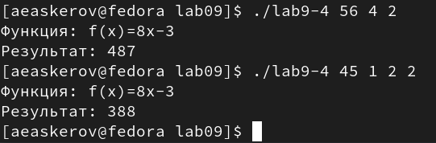{ #fig:12 }

# Выводы

Приобретены навыки написания программ с использованием циклов и обработкой аргументов командной строки.
