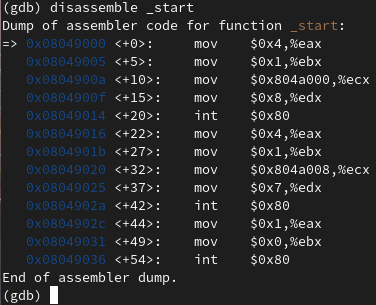
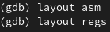
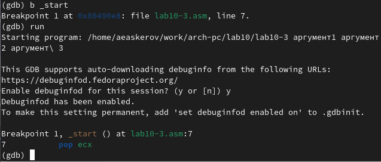

---
## Front matter
title: "Отчёт по лабораторной работе №10"
subtitle: "Понятие подпрограммы. Отладчик GDB"
author: "Аскеров Александр Эдуардович"

## Generic otions
lang: ru-RU
toc-title: "Содержание"

## Bibliography
bibliography: bib/cite.bib
csl: pandoc/csl/gost-r-7-0-5-2008-numeric.csl

## Pdf output format
toc: true # Table of contents
toc-depth: 2
lof: true # List of figures
lot: false # List of tables
fontsize: 12pt
linestretch: 1.5
papersize: a4
documentclass: scrreprt
## I18n polyglossia
polyglossia-lang:
  name: russian
  options:
	- spelling=modern
	- babelshorthands=true
polyglossia-otherlangs:
  name: english
## I18n babel
babel-lang: russian
babel-otherlangs: english
## Fonts
mainfont: PT Serif
romanfont: PT Serif
sansfont: PT Sans
monofont: PT Mono
mainfontoptions: Ligatures=TeX
romanfontoptions: Ligatures=TeX
sansfontoptions: Ligatures=TeX,Scale=MatchLowercase
monofontoptions: Scale=MatchLowercase,Scale=0.9
## Biblatex
biblatex: true
biblio-style: "gost-numeric"
biblatexoptions:
  - parentracker=true
  - backend=biber
  - hyperref=auto
  - language=auto
  - autolang=other*
  - citestyle=gost-numeric
## Pandoc-crossref LaTeX customization
figureTitle: "Рис."
tableTitle: "Таблица"
listingTitle: "Листинг"
lofTitle: "Список иллюстраций"
lotTitle: "Список таблиц"
lolTitle: "Листинги"
## Misc options
indent: true
header-includes:
  - \usepackage{indentfirst}
  - \usepackage{float} # keep figures where there are in the text
  - \floatplacement{figure}{H} # keep figures where there are in the text
---

# Цель работы

Приобрести навыки написания программ с использованием подпрограмм. Познакомиться с методами отладки при помощи GDB и его основными возможностями.

# Выполнение лабораторной работы

## Реализация подпрограмм в NASM

1. Создадим каталог для выполнения лабораторной работы №10, перейдём в него и создадим файл lab10-1.asm.

{ #fig:1 }

2. В качестве примера рассмотрим программу вычисления арифметического выражения f(x) = 2x + 7 с помощью подпрограммы _calcul. В данном примере x вводится с клавиатуры, а само выражение вычисляется в подпрограмме. 

Внимательно изучим текст программы.

Введём в файл lab10-1.asm текст программы из листинга 10.1. Создадим исполняемый файл и проверим его работу.

{ #fig:2 }

Изменим текст программы, добавив подпрограмму _subcalcul в подпрограмму _calcul для вычисления выражения f(g(x)), где x вводится с клавиатуры, f(x) = 2x + 7, g(x) = 3x − 1. Т.е. x передаётся в подпрограмму _calcul из неё в подпрограмму _subcalcul, где вычисляется выражение g(x), результат возвращается в _calcul и вычисляется выражение f(g(x)). Результат возвращается в основную программу для вывода результата на экран.

{ #fig:3 }

## Отладка программам с помощью GDB

Создадим файл lab10-2.asm с текстом программы из Листинга 10.2. (Программа печати сообщения Hello world!).

{ #fig:4 }

Получим исполняемый файл. Для работы с GDB в исполняемый файл необходимо добавить отладочную информацию, для этого трансляцию программ необходимо проводить с ключом ‘-g’.

{ #fig:5 }

Загрузим исполняемый файл в отладчик gdb.

{ #fig:6 }

Проверим работу программы, запустив её в оболочке GDB с помощью команды run (сокращённо r).

{ #fig:7 }

Для более подробного анализа программы установим брейкпойнт на метку _start, с которой начинается выполнение любой ассемблерной программы, и запустим её.

{ #fig:8 }

Посмотрим дизассемблированный код программы с помощью команды disassemble, начиная с метки _start.

{ #fig:9 }

Переключимся на отображение команд с Intel’овским синтаксисом, введя команду set disassembly-flavor intel.

{ #fig:10 }

Перечислим различия отображения синтаксиса машинных команд в режимах ATT и Intel.

В ATT сначала записывается адрес, потом регистр, перед адресом регистра ставится $, перед названием регистра %. В Intel сначала регистр, потом адрес и перед ними ничего не ставится.

Включим режим псевдографики для более удобного анализа программы.

{ #fig:11 }

### Добавление точек останова

Установить точку останова можно командой break (кратко b). Типичный аргумент этой команды – место установки. Его можно задать или как номер строки программы (имеет смысл, если есть исходный файл, а программа компилировалась с информацией об отладке), или как имя метки, или как адрес.

Чтобы не было путаницы с номерами, перед адресом ставится "звёздочка". На предыдущих шагах была установлена точка останова по имени метки (_start). Проверим это с помощью команды info breakpoints (кратко i b).

{ #fig:12 }

Установим ещё одну точку останова по адресу инструкции. Адрес инструкции можно увидеть в средней части экрана в левом столбце соответствующей инструкции. Определим адрес предпоследней инструкции (mov ebx,0x0) и установим точку останова.

{ #fig:13 }

Посмотрим информацию о всех установленных точках останова.

{ #fig:14 }

### Работа с данными программы в GDB

Отладчик может показывать содержимое ячеек памяти и регистров, а при необходимости позволяет вручную изменять значения регистров и переменных.

Выполним 5 инструкций с помощью команды stepi (или si) и проследим за изменением значений регистров. Изменяются значения регистров eax, ebx, ecx и edx.

Посмотреть содержимое регистров также можно с помощью команды info registers (или i r).

{ #fig:15 }

Для отображения содержимого памяти можно использовать команду x, которая выдаёт содержимое ячейки памяти по указанному адресу. Формат, в котором выводятся данные, можно задать после имени команды через косую черту: x/NFU.

С помощью команды x &<имя переменной> также можно посмотреть содержимое переменной.

Посмотрите значение переменной msg1.

{ #fig:16 }

Посмотрим значение переменной msg2 по адресу. Адрес переменной можно определить по дизассемблированной инструкции. Посмотрим инструкцию mov ecx,msg2 которая записывает в регистр ecx адрес перемененной msg2.

{ #fig:17 }

Изменить значение для регистра или ячейки памяти можно с помощью команды set, задав ей в качестве аргумента имя регистра или адрес. При этом перед именем регистра ставится префикс $, а перед адресом нужно указать в фигурных скобках тип данных (размер сохраняемого значения; в качестве типа данных можно использовать типы языка Си). Изменим первый символ переменной msg1.

{ #fig:18 }

Заменим любой символ во второй переменной msg2.

{ #fig:19 }

Чтобы посмотреть значения регистров используется команда print /F val (перед именем регистра обязательно ставится префикс $): p/F $\<регистр\>.

Выведем в различных форматах (в шестнадцатеричном формате, в двоичном формате и в символьном виде) значение регистра edx.

{ #fig:20 }

С помощью команды set изменим значение регистра ebx.

{ #fig:21 }

Разница в выводе команд p/s $ebx заключается в том, что 50 – это номер символа 2 в таблице ASCII, в то время как 2 – это просто число 2.

Завершим выполнение программы с помощью команды continue (сокращенно c) или stepi (сокращенно si) и выйдем из GDB с помощью команды quit (сокращенно q).

{ #fig:22 }

### Обработка аргументов командной строки в GDB

Скопируем файл lab9-2.asm, созданный при выполнении лабораторной работы №9, с программой, выводящей на экран аргументы командной строки (Листинг 9.2), в файл с именем lab10-3.asm.

{ #fig:23 }

Создадим исполняемый файл.

{ #fig:24 }

Для загрузки в gdb программы с аргументами необходимо использовать ключ --args. Загрузим исполняемый файл в отладчик, указав аргументы.

{ #fig:25 }

Как отмечалось в предыдущей лабораторной работе, при запуске программы аргументы командной строки загружаются в стек.

Исследуем расположение аргументов командной строки в стеке после запуска программы с помощью gdb.

Для начала установим точку останова перед первой инструкцией в программе и запустим её.

{ #fig:26 }

Адрес вершины стека храниться в регистре esp и по этому адресу располагается число равное количеству аргументов командной строки (включая имя программы).

{ #fig:27 }

Как видно, число аргументов равно 5 – это имя программы lab10-3 и непосредственно аргументы: аргумент1, аргумент, 2 и 'аргумент 3'.
Посмотрим остальные позиции стека – по адесу \[esp + 4\] располагается адрес в памяти, где находится имя программы, по адесу \[esp + 8\] хранится адрес первого аргумента, по аресу \[esp + 12\] – второго и т.д.

{ #fig:28 }

Шаг равен четырём из-за того, что на позицию, которая хранит элемент стека, выделяется 4 байта.

## Задания для самостоятельной работы

1. Преобразуем программу из лабораторной работы №9 (Задание №1 для самостоятельной работы), реализовав вычисление значения функции f(x) как подпрограмму.

{ #fig:29 }

2. В листинге 10.3 приведена программа вычисления выражения (3 + 2) * 4 + 5. При запуске данная программа даёт неверный результат. Проверим это. С помощью отладчика GDB, анализируя изменения значений регистров, определим ошибку и исправим её.

{ #fig:30 }

Результат действительно не соответствует ожидаемому.

{ #fig:31 }

С помощью GDB были пошагово просмотрены шаги выполнения программы. Выяснилось, что регистр ecx умножается на изначальное значение регистра eax, а не на значение, полученное после сложения eax и ebx. Причина этого в том, что результат сложения сохраняется в ebx, в то время как ecx умножается на eax, который остался равным двум. Потом, вместо того чтобы прибавить 5 к eax (который должен был бы равняться 20, а равняется 2), 5 прибавляется к регистру ebx, равному пяти. Таким образом, мы получаем 8 и, впоследствии, 10, вместо 20 и, впоследствии, 25. Также нужно помещать в регистр edi, предназначенный для хранения ответа, регистр eax, а не регистр ebx.

Теперь исправим выявленные ошибки и получим верный ответ.

{ #fig:32 }

# Выводы

Приобретены навыки написания программ с использованием подпрограмм. Изучены методы отладки при помощи GDB и его основные возможности.
