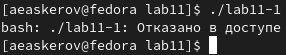

---
## Front matter
title: "Отчёт по лабораторной работе №11"
subtitle: "Работа с файлами средствами NASM"
author: "Аскеров Александр Эдуардович"

## Generic otions
lang: ru-RU
toc-title: "Содержание"

## Bibliography
bibliography: bib/cite.bib
csl: pandoc/csl/gost-r-7-0-5-2008-numeric.csl

## Pdf output format
toc: true # Table of contents
toc-depth: 2
lof: true # List of figures
lot: false # List of tables
fontsize: 12pt
linestretch: 1.5
papersize: a4
documentclass: scrreprt
## I18n polyglossia
polyglossia-lang:
  name: russian
  options:
	- spelling=modern
	- babelshorthands=true
polyglossia-otherlangs:
  name: english
## I18n babel
babel-lang: russian
babel-otherlangs: english
## Fonts
mainfont: PT Serif
romanfont: PT Serif
sansfont: PT Sans
monofont: PT Mono
mainfontoptions: Ligatures=TeX
romanfontoptions: Ligatures=TeX
sansfontoptions: Ligatures=TeX,Scale=MatchLowercase
monofontoptions: Scale=MatchLowercase,Scale=0.9
## Biblatex
biblatex: true
biblio-style: "gost-numeric"
biblatexoptions:
  - parentracker=true
  - backend=biber
  - hyperref=auto
  - language=auto
  - autolang=other*
  - citestyle=gost-numeric
## Pandoc-crossref LaTeX customization
figureTitle: "Рис."
tableTitle: "Таблица"
listingTitle: "Листинг"
lofTitle: "Список иллюстраций"
lotTitle: "Список таблиц"
lolTitle: "Листинги"
## Misc options
indent: true
header-includes:
  - \usepackage{indentfirst}
  - \usepackage{float} # keep figures where there are in the text
  - \floatplacement{figure}{H} # keep figures where there are in the text
---

# Цель работы

Приобрести навыки написания программ для работы с файлами.

# Выполнение лабораторной работы

1. Создадим каталог для программ лабораторной работы №11, перейдём в него и создадим файлы lab11-1.asm и readme.txt.

{ #fig:1 }

2. Введём в файл lab11-1.asm текст программы из листинга 11.1 (Программа записи в файл сообщения). Создадим исполняемый файл и проверим его работу.

{ #fig:2 }

3. С помощью команды chmod изменим права доступа к исполняемому файлу lab11-1, запретив его выполнение.

{ #fig:3 }

Попытаемся выполнить файл.

{ #fig:4 }

Объясним результат: при попытке выполнить файл lab11-1 нам было отказано в доступе, так как мы запретили выполнение файла для всех.

4. С помощью команды chmod изменим права доступа к файлу lab11-1.asm с исходным текстом программы, добавив права на исполнение.

{ #fig:5 }

Попытаемся выполнить его.

{ #fig:6 }

Объясним результат: файл с расширением .asm не является исполняемым, поэтому он не бы выполнен; разрешение на исполнение файл (атрибут x) в данном случае не является определяющим.

5. Предоставим права доступа к файлу readme.txt в соответствии с вариантом 19 и проверим правильность выполнения с помощью команды ls -l.

{ #fig:7 }

## Задание для самостоятельной работы

Напишем программу, работающую по следующему алгоритму:

* Вывод приглашения “Как Вас зовут?”
* Ввести с клавиатуры свои фамилию и имя
* Создать файл с именем name.txt
* Записать в файл сообщение “Меня зовут”
* Дописать в файл строку, введённую с клавиатуры
* Закрыть файл

Создадим исполняемый файл и проверим его работу.

{ #fig:8 }

Проверим наличие файла с помощью команды ls.

{ #fig:9 }

Проверим содержимое файла с помощью команды cat.

{ #fig:10 }

# Выводы

Приобретены навыки написания программ для работы с файлами.
